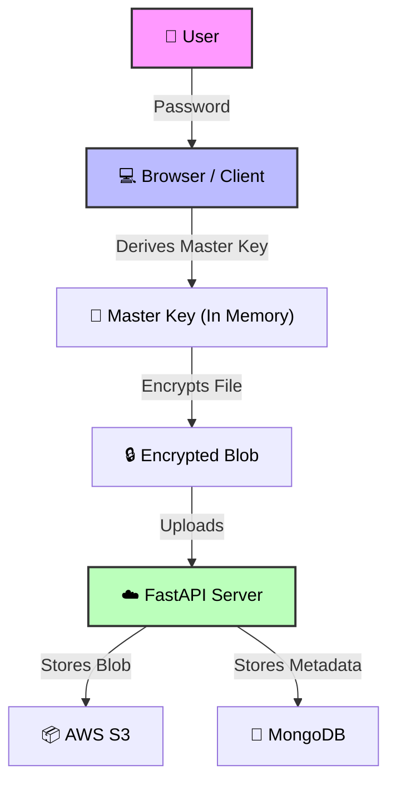

<div align="center">

# 🔐 CryptoCloud
### Zero-Knowledge. Absolute Privacy. End-to-End Encrypted.

[](https://nextjs.org/)
[](https://fastapi.tiangolo.com/)
[](https://www.docker.com/)
[](LICENSE)

<br />

**CryptoCloud** is a full-stack, zero-knowledge cloud storage platform.
Unlike standard providers, **we cannot see your files.**
All encryption happens in your browser before data ever reaches our servers.

[Report Bug](https://github.com/nimirdevx/CRYPTOCLOUD/issues) · [Request Feature](https://github.com/nimirdevx/CRYPTOCLOUD/issues)

</div>

---

## 🏗️ Security Architecture

CryptoCloud utilizes a **Hybrid Encryption Model** (AES-256-GCM + RSA-OAEP). The server stores only encrypted blobs and has **zero access** to user passwords, private keys, or file contents.



🛡️ Encryption Specs
Zero-Knowledge: Server never sees unencrypted data.

Master Key: Derived from password (PBKDF2/Argon2), exists only in browser memory.

Envelope Encryption: Files encrypted with unique AES keys; File Keys encrypted with user's Public RSA Key.

## Destructive Reset: Resetting a password securely wipes all data to maintain zero-knowledge guarantees.

## 🚀 Key Features

| 🛡️ Security & Privacy                                                 | 📂 File Management                                                     |
| :-------------------------------------------------------------------- | :--------------------------------------------------------------------- |
| **Client-Side Encryption**<br>AES-256-GCM & RSA-OAEP.                 | **Recursive Folders**<br>Deeply nested directory structures.           |
| **2FA Protection**<br>TOTP (Google Auth/Authy) + Backup Codes.        | **Secure Previews**<br>View Images/PDFs in-memory without disk writes. |
| **Secure Session Lock**<br>Auto-lock on refresh; requires re-entry.   | **Drag & Drop**<br>Modern UI with live progress bars.                  |
| **End-to-End Sharing**<br>Secure sharing via Public Key cryptography. | **Storage Quota**<br>Real-time usage tracking (e.g., 1.2GB / 5GB).     |

---

## 🛠️ Technology Stack

### **Frontend (Client)**

- **Framework:** Next.js 16 (React 19)
- **Styling:** Tailwind CSS v4
- **Cryptography:** Web Crypto API (SubtleCrypto)
- **Language:** TypeScript

### **Backend (Server)**

- **Core:** FastAPI (>=0.104.0), Uvicorn
- **Database:** MongoDB Atlas (via `motor` & `pymongo`)
- **Validation:** Pydantic v2
- **Storage:** AWS S3 (via `boto3`)
- **Security & Auth:**
  - `pyjwt` (JWT Tokens)
  - `passlib[bcrypt]` (Hashing)
  - `pyotp` (2FA/TOTP)
  - `pycryptodome` (Server-side crypto utils)
- **Email:** `fastapi-mail`

### **DevOps**

- **Containerization:** Docker (Full stack)
- **Orchestration:** Docker Compose

---

## ⚡ Getting Started

### Prerequisites

- Docker & Docker Compose
- MongoDB Atlas URI
- AWS S3 Bucket (Access Key & Secret)
- Gmail Account (App Password for SMTP)

### Installation

1.  **Clone the repository**

    ```bash
    git clone https://github.com/nimirdevx/CRYPTOCLOUD.git
    cd CRYPTOCLOUD
    ```

2.  **Configure Environment**
    Create a `.env` file in the `backend/` directory:

    ```env
    # backend/.env

    # Database
    MONGO_URI=mongodb+srv://<user>:<password>@cluster.mongodb.net/cryptocloud
    SECRET_KEY=your_super_secret_jwt_key

    # AWS S3 Storage
    AWS_ACCESS_KEY_ID=your_aws_key
    AWS_SECRET_ACCESS_KEY=your_aws_secret
    S3_BUCKET_NAME=your-bucket-name
    S3_REGION=us-east-1

    # Email Service (Gmail)
    MAIL_USERNAME=your-email@gmail.com
    MAIL_PASSWORD=your-16-digit-app-password
    MAIL_FROM=your-email@gmail.com
    MAIL_PORT=587
    MAIL_SERVER=smtp.gmail.com
    MAIL_STARTTLS=True
    MAIL_SSL_TLS=False
    ```

3.  **Run with Docker**

    ```bash
    docker-compose up --build
    ```

4.  **Access the App**
    - **Frontend:** `http://localhost:3000`
    - **API Documentation:** `http://localhost:8000/docs`

---

## 🤝 Contributing

Contributions are welcome!

1.  Fork the Project
2.  Create your Feature Branch (`git checkout -b feature/AmazingFeature`)
3.  Commit your Changes (`git commit -m 'Add some AmazingFeature'`)
4.  Push to the Branch (`git push origin feature/AmazingFeature`)
5.  Open a Pull Request

---

## 📄 License

Distributed under the MIT License. See `LICENSE` for more information.

<p align="center">
  <br>
  Made with ❤️ for Privacy by <a href="https://github.com/nimirdevx">NimirDevX</a>
</p>
